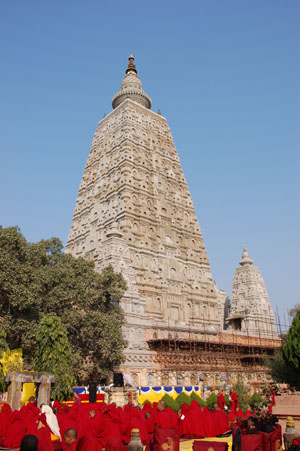

## History of Bodhgaya

Bodhgaya is one of the holiest Buddhist pilgrimage sites. It is located in Gaya District of Bihar state in India. Prince Siddhartha attained perfect enlightenment under a bodhi tree in Bodygaya some 2,500 years ago. Historically, the seat where the Buddha attained enlightenment under the Bodhi tree is known as the Bodhimanda. Some 250 years later, dharma king Ashoka visited this holy site and he is considered the founder of the Mahabodhi Temple. The famous Chinese monk scholar Xuanzang visited this site in 637 CE. 

The sacred site of Bodhgaya was "lost" for centuries as Buddhism declined in India. After Burmese Buddhists rediscovered it in the 1880s, the British colonial government began restoration work. In 1891, the Sri Lankan Buddhist leader Anagarika Dharmapa founded the Mahabodhi Society and started a campaign to return control of the temple to Buddhists. In 1949, the Society became part of the 9-member management committee of the temple. In 2002, UNESCO declared Bodhgaya a World Heritage Site.

For more information, refer to the following links: 

   * [Wikipedia article](https://en.wikipedia.org/wiki/Bodh_Gaya).
   * [Bodhgaya Tourism](http://www.bodhgayatourism.com/)
   * [WikiTravel Bodhgaya Page](http://wikitravel.org/en/Bodh_Gaya)
   * [Explore Bihar Bodhgaya Page](http://www.explorebihar.in/bodh-gaya.html)
   * [Trip Advisor Bodhgaya Page](https://www.tripadvisor.com/Tourism-g424922-Bodh_Gaya_Bihar-Vacations.html)

