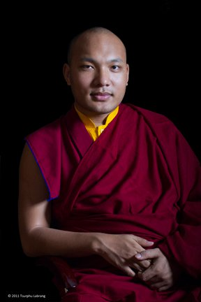
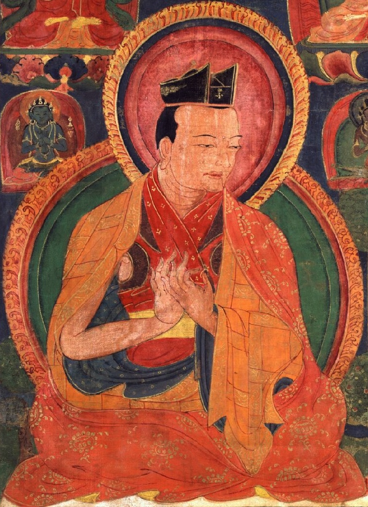

## His Holiness the 17th Karmapa, Ogyen Trinley Dorje

As a scholar and meditation master, as well as painter, poet, songwriter, playwright, and lineage head, the Gyalwang Karmapa embodies a wide range of the activities that Karmapas have engaged in over the centuries. As an [environmental activist](http://www.khoryug.com/), computer enthusiast, and world spiritual leader whose [teachings are often webcast live](http://www.karmapa-teachings.org/), the Seventeenth Gyalwang Karmapa has brought the Karmapa lineage's activities fully into the 21st century.

He has led the Kagyu Monlam Chenmo since 2004.

To learn more about His Holiness the 17th Gyalwang Karmapa, please visit his [biography page](http://kagyuoffice.org/karmapa/).

## The Four Karmapas
The Karmapas who have a particular connection with Monlam are the Seventh to the Tenth Karmapa. They are, in order: 

1. [Karmapa Chödrak Gyatso](http://kagyuoffice.org/kagyu-lineage/the-golden-rosary/the-7th-karmapa-tashi-paljor/) who was skilled in logic and Madhyamaka
1. [Karmapa Mikyö Dorje](http://kagyuoffice.org/kagyu-lineage/the-golden-rosary/the-8th-karmapa-mikyo-dorje/), who composed an unparalleled commentary on both sutra and tantra.
1. [Karmapa Wangchuk Dorje](http://kagyuoffice.org/kagyu-lineage/the-golden-rosary/289-2/) who compiled the essential instructions for Mahamudra.
1. [Karmapa Chöying Dorje](http://kagyuoffice.org/kagyu-lineage/the-golden-rosary/10th-karmapa/) for unfolding the secret meaning of Arts, Crafts and Poetry. They had the experience of leading the Monlam assemblies at different times and have become the symbol of protection and support for the survival or demise of Kagyu Monlam.

### The 7th Karmapa Chödrak Gyatso

* 1454: he was born in the region of Barkham Ngoe Kyidha (present day Nyingtri Pume Dzong district, T.A.R.).His father's name was Dragpa Paldrub and his mother's name was Lhamo Kyi.
* 1454, 9th Month: he was enthroned and recognized as the re-incarnation of the Sixth Black Hat lineage holder.
* 1465: aged eleven, he was ordained and given the name Choedrak Gyatso. He received many teachings on both sutra and tantra from the abbot who ordained him.
* From a very young age he travelled all over Tibet, giving teachings, founding monasteries and acting as a mediator in innumerable disputes. In this respect, he played an integral role in settling a major political dispute in U-Tsang, Central Tibet between Kagyu and Geluk.
* I506: he died at the age of fifty two, leaving behind a prediction letter concerning his future rebirth.

### The 8th Karmapa Mikyö Dorje

* 1507: he was born near the Ngumchu River (present day Chamdo, Riwoche Dzong District). His father's name was Jampa Shenyen and his mother's name was Dhara Seldron.
* 1513: at the age of six he was enthroned and ordained. From an early age, he received teachings on major treatises of sutra and tantra, empowerments, transmissions, and religious instruction, studied the five major and five minor sciences, and was able to integrate them all and put them into his practice. Having realized that there is no essence in gain and status, though he received invitations from the Emperor of China, he did not go. He dedicated his whole life solely to the three dharma activities – teaching, debating and composition (chad-tsoe-tsom).
* 1554: he died at the age of forty seven, having written the letter predicting his next incarnation twenty years before he died.

### The 9th Karmapa Wangchuk Dorje

* 1556: he was born in Dhokham, Tehor (present day Kardze Dzong). His father's name was Ador and his mother's name was Aloe. After five years of investigation as to whether or not he was the true incarnation, he was found to be genuine.
* 1561: he was recognized at the age of five, took ordination and was given the name Mipham Choekyi Wangchuk.
* He compiled sutra and tantra practices in detail and composed different types of Mahamudra text; for this reason he contributed a great service to the essence of the Buddha's teaching.
* 1603: he died at the age of forty seven. He left a verbal prediction concerning his future incarnation with his principal student.

### The 10th Karmapa Chöying Dorje

* 1604: he was born in Martoe, Ki-si-thang (present day Tso-ngon in Golok Pema Dzong district). His father's name was Khyigu Thar and his mother's name was Atso.
* 1611: at the age of seven he was enthroned.
* 1615: at the age of eleven, he took ordination and was given the name Choeying Dorje. He received many teachings from many learned siddhas. He became famous for his arts and crafts skills and poetry. When the Goshir Han invaded Tibet, he was forced to flee to Jang-yul. He extended extraordinary benefit to both humans and animals through his love and compassion. He lived almost his entire life in remote places.
* 1673: The Fifth Dalai Lama gave him a letter which permitted him to go to Central Tibet.
* 1674: he died at the age of seventy.