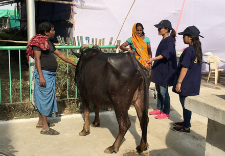

# Contents

   * <a href="#2017-23-01">The Fourth Annual Kagyu Monlam Animal Medical Camp Is Under Way</a>
   * <a href="#2017-20-01">Important Announcement Concerning the Chakrasamvara Empowerment</a>
   * <a href="#2017-19-01">Clothing for Lay Practitioners Attending the 34th Kagyu Monlam</a>
   

# The Fourth Annual Kagyu Monlam Animal Medical Camp Is Under Way in Bodhgaya
Monlam Pavilion, Bodhgaya
23rd January, 2017

The annual Kagyu Monlam Animal Medical Camp has begun and will run until 29th January, 2017. This year the camp is located in front of the main entrance gate to the Monlam Pavilion.

Over ten days, an international team of vets and para-vets will be delivering important animal welfare and public health initiatives to the people of Bodhgaya and surrounding villages.  As in previous years, camp activities include:

   * a street dog sterilisation and anti-rabies vaccination programme;
   * an outpatients clinic where local people can bring both pets and livestock for free treatment;
   * an outreach programme of vets and veterinary assistants travelling to local communities to treat animals and give advice on husbandry;
   * an educational initiative to instruct both children and adults in rabies prevention and compassionate treatment of animals.

The core veterinary team is from the Sikkim Anti-Rabies Animal Health Division, Government of Sikkim and is headed by Dr Thinlay Nedup and his wife Dr Diki Palmu Sherpa, assisted by Joy from the NGO Dogs of Gaya. They have been joined by three vet volunteers from Australia, three local vets from Gaya, and monks from various Kagyu monasteries.

The main sponsors for this year's camp are the Brigitte Bardot Foundation which is funding all medicines, veterinary equipment and some of the educational materials, and the Kagyupa International Monlam Trust, which has facilitated the camp and provided free food and accommodation for staff as well as travelling expenses for Himalayan staff. Additional educational materials have been provided by Khoryug, the Gyalwang Karmapa's environmental organisation.

After three years of working together, the team is now well-established in the area and trusted by local people. Immediately the camp opened, patients appeared, and when the team goes out to round up stray dogs for treatment, local villagers support their efforts because they realise the benefits for everyone.

In addition, the team's work is now informed by its knowledge of local conditions and customs. For example, they noticed that local goats were suffering excessively from parasitic and bacterial infections causing diarrhoea. When they investigated further, the team discovered that it was the local custom not to give the goats drinking water during cold weather; local villagers believed that drinking cold water made the goats ill. Consequently, the goats became dehydrated and, when they were released daily to forage, they were drinking stagnant, contaminated water from ponds and roadside ditches.  Once the villagers were told the real source of the illness, they began giving water to the goats and the incidence of diarrhoea decreased drastically.

The educational initiative with local children is particularly successful this year. The children are choosing to come to the animal camp on their own initiative, partly the team suspects because of the free colouring books and crayons. They are consolidating their knowledge from previous years. They have learned how to interpret dog body language so that they can avoid being bitten, what to do if they are attacked by an aggressive dog, and how to clean a wound if they are bitten.

Finally, each day on average 40 dogs, mainly street dogs, are de-sexed and vaccinated against rabies, and up to 180 outpatients are treated.

# Important Announcement Concerning the Chakrasamvara Empowerment
## Commitment Requirement
The purpose of this empowerment is to fulfil the practice requirements of both Guru Yoga, the fourth uncommon preliminary practice in the Karma Kamtsang, and the Eighth Karmapa’s "Four-Session Guru Yoga".

Therefore, recipients of this empowerment will need to make the commitment to recite the "Four-Session Guru Yoga" at least once a day for the rest of their lives. Unless you are prepared to keep this commitment, you should not attend the empowerment.

## Arrangements for Webcasting  During this Event

   * The Chakrasamvara empowerment (7-8 February, 2017), will not be webcast.
   * The first two days of the pre-Monlam teachings (9-10 February, 2017), on the Guru Yoga section of “The Torch of True Meaning”, will be webcast. 
   * The transmission and explanation of the Eighth Karmapa’s "Four-Session Guru Yoga", which will be given on the third day of the pre-Monlam teachings (11 February, 2017), will not be webcast.

 
 # Clothing for Lay Practitioners Attending the 34th Kagyu Monlam

All lay practitioners attending the 34th Kagyu Monlam in Bodhgaya are encouraged to receive the Mahayana Sojong vows each day.

In accordance with tradition, lay practitioners who receive the Mahayana Sojong vows, both men and women, should dress completely in white during this time, as a sign of purification. 

